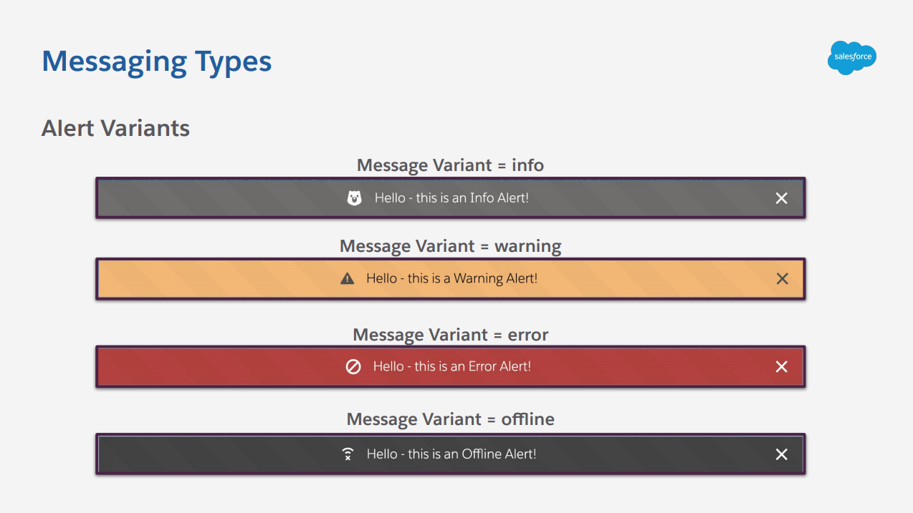
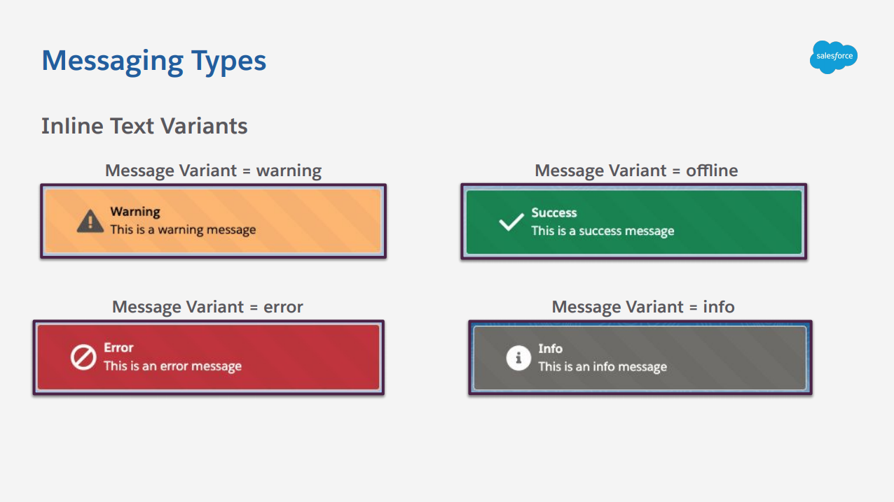
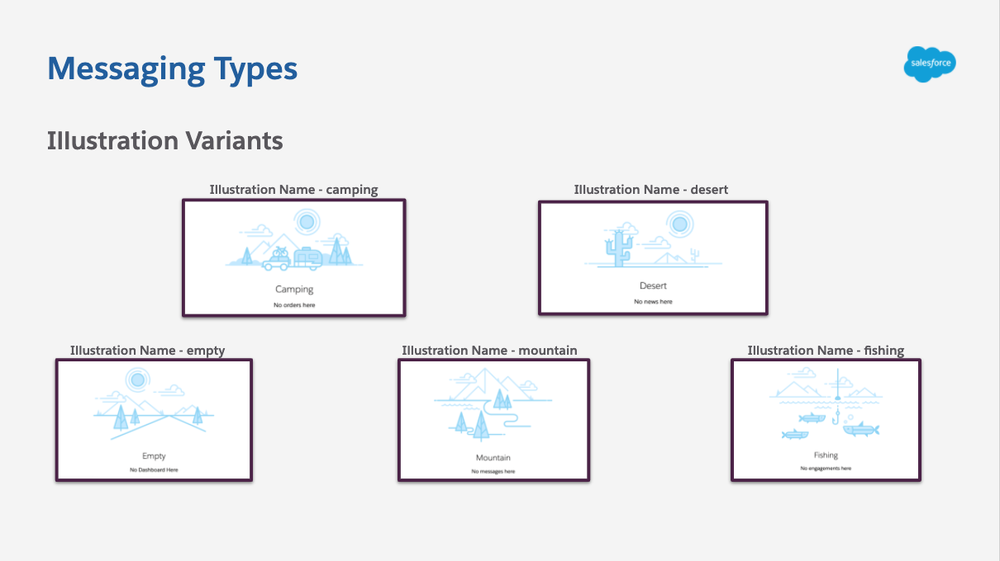

# Lightning Messaging Utility([AppExchange](https://appexchange.salesforce.com/appxListingDetail?listingId=a0N3u00000MBecDEAT))

Whether you're a Salesforce Admin or Developer - the way you deliver messages to your users is key to building a user-friendly app! Lighting Messaging Utility gives you the tools you need to build clean and consistent messages at all times!

Lightning Messaging Utility gives you the ability to drag and drop messaging components into the lighting app builder as well as using them programmatically to speed up development!

## Lightning Design System Messaging Guidelines

Always reference the Lightning Design System Messaging Guidelines when using this component: https://www.lightningdesignsystem.com/guidelines/messaging/overview/#site-main-content

## Installation

**Clone the Lightning Messaging Utility repository and push to your org**

```
git clone https://github.com/schandlergarcia/lightning-messaging-utility
cd lightning-messaging-utility
sfdx force:source:push -u <org username>
```

## Code Samples

This component was designed to give you an easy to use some of the SLDS messaging types in your Lightning Web Components, the full documentation can be found on the [AppExchange](https://partners.salesforce.com/servlet/servlet.FileDownload?file=00P3A00000nKwoiUAC).

### 1) Alert

```xml
    <c-lwc-messaging-utility message-type="alert"
                             message-title="Error Connecting to the Streaming API"
                             message-variant="error"
                             show-icon=true
                             icon-name="utility:error"
                             icon-alternative-text="An error has occurred"
                             icon-size="small"
                             icon-variant="error"
                             allow-close=true
                             max-width="100"
                             showMessage="true">
    </c-lwc-messaging-utility>
```



### 2) Inline Text

```xml
    <c-lwc-messaging-utility message-type="inline"
                             message-title="Warning"
                             message-body="This person can not be contacted"
                             message-variant="warning"
                             show-icon=true
                             icon-name="utility:warning"
                             icon-alternative-text="warning"
                             icon-size="small"
                             icon-variant="warning"
                             max-width="100"
                             showMessage="true">
    </c-lwc-messaging-utility>
```



### 3) Illustration

```xml
    <c-lwc-messaging-utility message-type="illustration"
                             message-title="Warning"
                             message-body="This person can not be contacted"
                             illustration-name="empty"
                             max-width="100"
                             showMessage="true">
    </c-lwc-messaging-utility>
```



### 4) Prompt

```xml
    <c-lwc-messaging-utility message-type="prompt"
                             message-title="Annual Maintenance"
                             message-body="We will be going under annual maintenance on..."
                             message-variant="info"
                             show-icon=true
                             icon-name="utility:info"
                             icon-alternative-text="info"
                             icon-variant="warning"
                             max-width="100"
                             button-label="OK"
                             showMessage="true">
    </c-lwc-messaging-utility>
```


## About

This component was built for Salesforce Labs and was created and maintained by [Andrew Paterson](https://github.com/apatersonSFDC) and [Stephan Chandler-Garcia](https://github.com/schandlergarcia)
